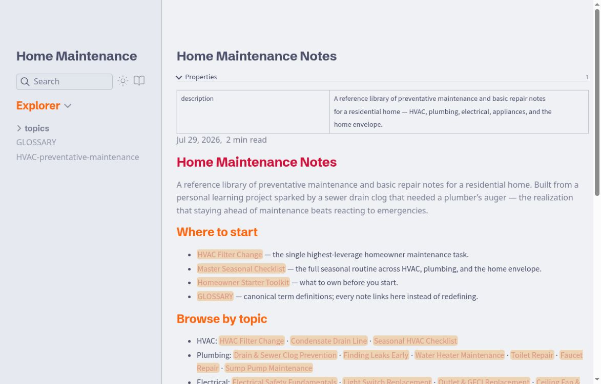
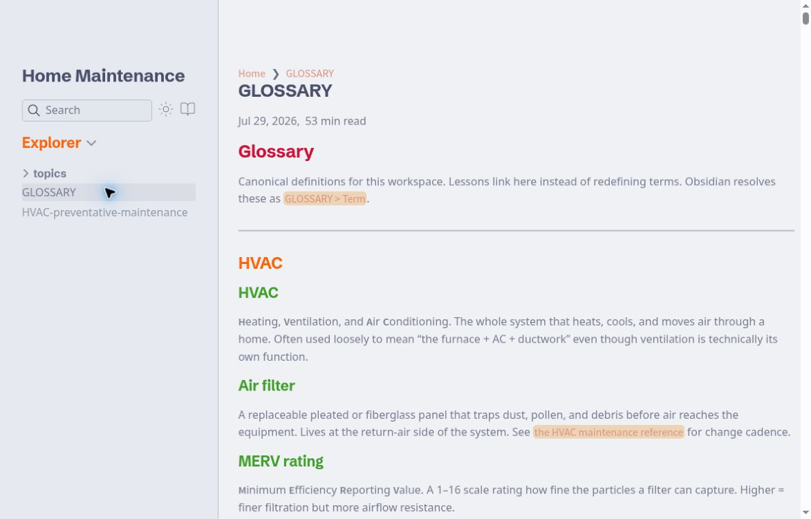
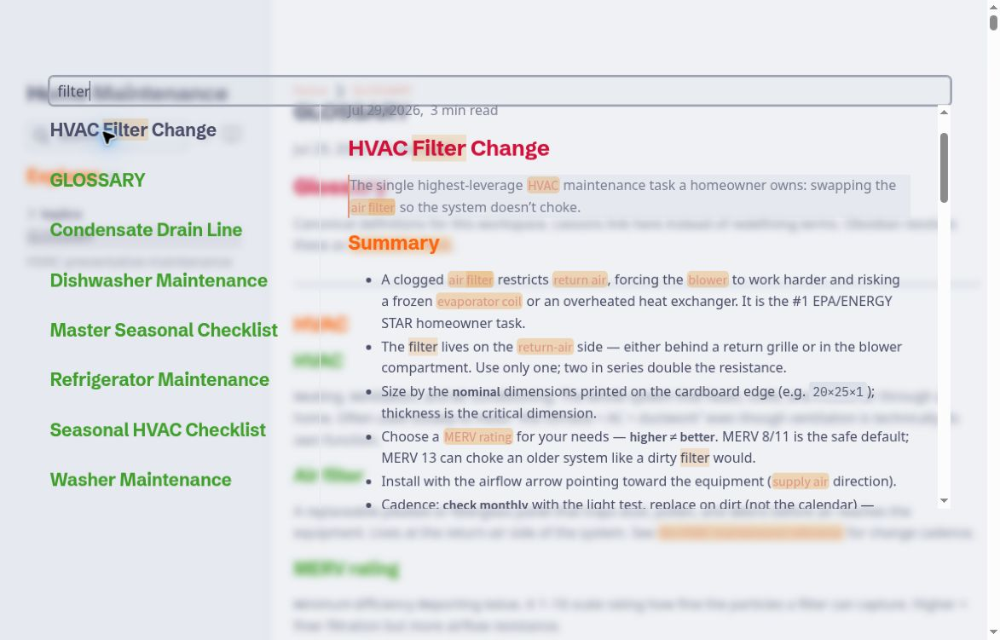

# Home Maintenance Notes

**A linked reference library for understanding a home’s systems and staying ahead of routine upkeep.**

Home Maintenance Notes organizes residential maintenance topics into searchable, connected Markdown pages. The project combines a personal reference collection with Quartz’s navigation, graph, backlinks, and reading tools.

[Browse the reference site](https://maintenance.graydonwasil.com/) · [Source notes](reference/index.md) · [Run locally](#run-locally)



*The home page connects the topic library, seasonal checklist, starter toolkit, and glossary.*

> These are reference and learning notes, not a substitute for manufacturer instructions, applicable requirements, or qualified professional advice. Electrical, gas, structural, and other hazardous work needs an appropriate assessment. This README describes the website and its maintenance workflow; it does not validate every repair procedure in the content.

## Find a topic

| Area | Examples in the library |
|---|---|
| **HVAC** | Filters, condensate drains, and seasonal checks |
| **Plumbing** | Leak detection, drains, water heaters, fixtures, and sump pumps |
| **Electrical** | Safety fundamentals and fixture-related reference notes |
| **Appliances** | Dryer, washer, refrigerator, dishwasher, and disposer upkeep |
| **Home envelope** | Roof/exterior inspection, winterization, drywall, alarms, and garage doors |
| **Planning and records** | Seasonal checklist, starter toolkit, glossary, documentation, and finding a professional |

Start with the home page for an overview, use search for a particular term, or follow related notes from a topic. The glossary provides shared definitions so each page does not need to repeat them.

## Explore connected notes



*The glossary gives shared terms a home in the same connected reading interface.*

The configured Quartz interface includes:

- **Search** for locating notes by their indexed content
- **Explorer** for browsing the folder and page structure
- **Table of contents** for moving within a note
- **Backlinks and graph** for seeing connections between pages
- **Page previews** for inspecting a linked note without immediately leaving the current one
- **Dark mode and reader mode** for changing the reading presentation



*A live search for “filter” returned eight links with an HVAC Filter Change preview.*

The site also generates a content index, sitemap, and RSS output through its configured plugins. This is a published reference library, rather than an account-based task tracker or a service that schedules maintenance visits.

## Run locally

The package requires **Node.js 22+** and **npm 10.9.2+**. The repository’s deployment workflow uses **Node 24**, which is a useful baseline for reproducing that environment.

```sh
git clone https://github.com/Arrangedgodly/maintenance.git
cd maintenance
npm ci
npx quartz build --serve -d reference
```

Open the local address printed by Quartz. The explicit `-d reference` matters: that is the checked-in content collection used by the deployment workflow. A local `content/` symlink is not part of the repository and should not be assumed to exist after cloning.

| Command | Purpose |
|---|---|
| `npx quartz build --serve -d reference` | Build and serve the reference collection locally |
| `npx quartz build -d reference` | Generate the static site in `public/` |
| `npm run check` | Run TypeScript checking and Prettier’s format check |
| `npm test` | Run the repository’s Node/tsx test command |
| `npm run docs` | Serve Quartz’s own documentation directory, not the maintenance collection |

There is no separate `npm run build` script in the current package. The workflow installs dependencies with `npm ci` and then builds `reference/`. A fresh check of this revision on Node 24.9.0 / npm 11.6.0 completed both commands successfully, processing 31 Markdown files and emitting 126 files. The configuration enables `@quartz-community/obsidian-plugin-excalidraw`, but it is absent from the checked-in package and lockfile: the build warns that it cannot load that plugin and skips it. Do not assume Excalidraw rendering is available in this checkout.

## Add or revise a note

1. Work in the intended public collection under `reference/`.
2. Give the note useful frontmatter, such as a title and short description.
3. Use Markdown and the configured wiki-link syntax to connect related topics and glossary entries.
4. Preview the generated page, its links, navigation, and narrow-screen layout.
5. Review the content’s sources and safety boundaries before publishing.

For example, a short editorial outline can begin as:

```md
---
title: Example Maintenance Topic
description: What this reference page helps a reader understand.
---

# Example Maintenance Topic

## Purpose

## What to check before proceeding

## When to contact a professional

## Sources and related notes
```

This is a content structure, not a repair procedure. Use project-appropriate filenames and links rather than copying the example title into the live collection.

## Keep publication boundaries explicit

The current configuration ignores `private`, `templates`, and `.obsidian`, and enables draft filtering. Its explicit-publish plugin is disabled. **Do not assume that an ordinary note is private merely because it has no navigation link or has not been marked for publication.** Review the selected input directory and generated output before deploying.

An unlisted page is a discoverability choice, not access control. The configuration also includes an encrypted-pages plugin, but its presence alone does not establish that a given note is protected. Keep personal records and private working material out of the public collection unless intentionally prepared for publication.

The site configuration includes Plausible analytics and Google Fonts settings. It should not be described as a no-network or analytics-free application without inspecting the generated deployment and its current behavior.

## Architecture

| Path | Role |
|---|---|
| `reference/` | The home-maintenance note collection built by CI |
| `quartz.config.yaml` | Site identity, plugins, layout, theme, and publication filters |
| `quartz/` | Quartz’s generator and supporting implementation |
| `docs/` | Upstream generator documentation |
| `.github/workflows/deploy.yml` | Build and GitHub Pages deployment workflow |
| `public/` | Generated output |

The project uses **Quartz 5**, **TypeScript**, **Preact**, and Markdown processing plugins. The configured visual theme is **fastppuccin**. The application is built on Quartz rather than being an original implementation of a static-site generator.

## Deployment

The checked-in workflow runs on pushes to `main` and manual dispatch. It installs dependencies, builds `reference/`, uploads `public/`, and deploys the artifact to GitHub Pages. The configured base URL is `maintenance.graydonwasil.com`.

A local preview does not publish anything. Pushing to the configured branch can trigger deployment, so check content boundaries and the generated result before doing so. Domain ownership, Pages settings, and workflow permissions belong to the host repository setup.

## Verification and credits

The build check above was performed on October 5, 2026 against revision `2e8ca638a2226ad78538885b6002d7e27cfb812b`. It was an install/build check, not a full test or accessibility audit. The screenshots show the live homepage, glossary, and search; they do not validate the safety or technical accuracy of the repair notes.

Before publishing a change, run the applicable checks, inspect the generated site, and verify the exact deployment result. Do not treat the existence of a workflow file as proof that a particular build passed.

The repository retains Quartz’s [MIT license and copyright notice](LICENSE.txt). Preserve upstream attribution and the terms of bundled plugins, themes, fonts, and any cited material. Learn more about the underlying generator at [Quartz](https://quartz.jzhao.xyz/).
